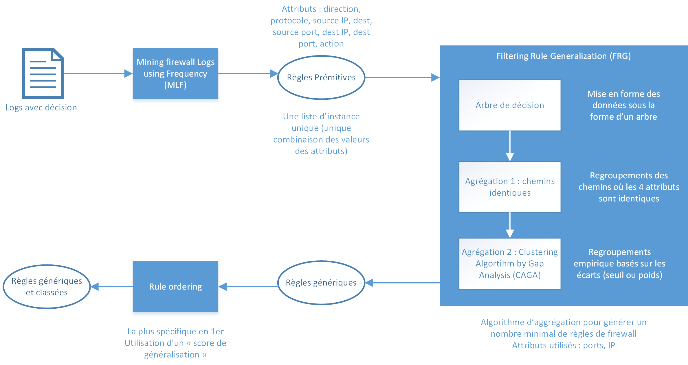

# TODO

- [x] Documentation
- [ ] Créer fonction (tools) pour lire logs (important data) dans fichiers json
- [ ] Choisir structure de données adaptées aux logs / règles de FW
- [ ] Ecrire algo génération "premitive rules"
- [ ] Trouver librairie pour construction arbre de décision
- [ ] Ecrire algo génération arbre de décision
- [ ] Ecrire algo détection des chemins identiques
- [ ] Ecrire Clustering Algo bu Gap Analaysis (CAGA)
- [ ] Ecrire algo d'ordonnancement des règles
# Description projet
**Projet** : Optimisation algo machine learning pour configurer automatiquement des pare-feux

Projet en 2 étapes : 
1. *Machine Learning* à partir de logs de firewalls afin de déterminer un modèle pour traiter automatiquement de nouveaux logs
2. *Data Mining* à partir des logs pour déterminer des règles de firawall les plus efficaces possibles. Développement de la méthode proposée dans l'article [*Analysis of Firewall Policy Rules Using data Mining Techniques*](https://ieeexplore.ieee.org/document/1687561)

Schéma process *Data Mining* : 



# Organisation du repository
### Dossier ```machine_learning```
### Dossier ```data_mining```

# Prérequis
(Windows)
### Machine Learning 
- *python-weka-wrapper3 prérequis* (from [here](http://fracpete.github.io/python-weka-wrapper3/install.html)) :
    - Python 3 (3.8 utilisé pour les développements)
    - Pip
    - Numpy
    - Javabridge
    - Graphviz
    - Matplotlib
    - Microsoft Build Tools 2015 

- python-weka-wrapper3 ([doc](http://fracpete.github.io/python-weka-wrapper3/install.html#windows))

### Data Mining 
- Python 3
