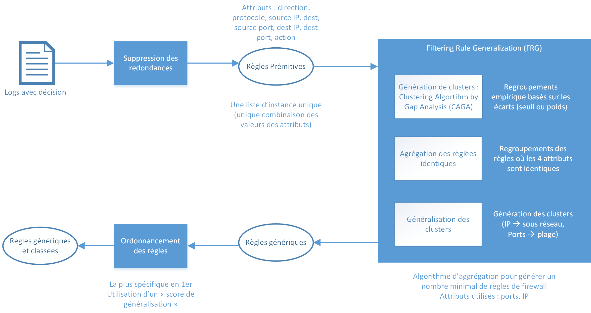

# Description projet
**Projet** : Optimisation algo machine learning / data mining pour configurer automatiquement des pare-feux

Projet en 3 étapes : 
1. *Machine Learning* à partir de logs de firewalls afin de déterminer un modèle pour traiter automatiquement de nouveaux logs
2. *Data Mining* à partir des logs pour déterminer des règles de firawall les plus efficaces possibles. Développements inspirés de la méthode proposée dans l'article [*Analysis of Firewall Policy Rules Using data Mining Techniques*](https://ieeexplore.ieee.org/document/1687561)
3. Envoi des règles à l'API Cisco

## Process Data Mining : 



<ins> Etapes clés pour l'algorithme FRG :
1. Génération clusters 
    - Regroupement @IP SRC qui ont les mêmes @IP DST et PORT
    - Regroupement @IP DST qui ont les mêmes @IP SRC et PORT
    - Regroupement  PORT   qui ont les mêmes @IP SRC et @IP DST
4. Suppresion des redondances
6. Généralisation des clusters

<ins> Pseudo code pour la généralisation des clusters 

(code dans ```filtering_rule_generation.py```)
```
MIN_LENGTH_CLUSTER = 10 # Minimum 10 IP dans un cluster (éviter masque trop précis)
Pour chaque cluster d'IP SRC et d'IP DST:
    Si longeur cluster>MIN_LENGTH_CLUSTER :
        new_cluster_IP = adresse IP sous-réseau à partir du 1er et du dernier élément du cluster
Pour chaque cluster de PORTS DST :
    Si cluster_PORT_dst[0]>1024 et cluster_PORT_dst[last]<=49151 :
        Si cluster_PORT_dst[0] == cluster_PORT_dst[last]:
            new_cluster_PORT = cluster_PORT_dst[0]
        Sinon :
            new_cluster_PORT = cluster_PORT_dst[0] + "-" + cluster_PORT_dst[last]
    Si cluster_PORT_dst[0]>49151 :
        new_cluster_PORT = "49152-65535"
    # Sinon (ports < 1024) : Ne rien faire
```

<ins> Etapes pour la génération des clusters par évaluation des distances CAGA

 (code dans ```clustering_algo_gap_analysis.py```)

*Entrée* : Liste d'éléments

*Sortie* : Liste de clusters

1. Trier la liste dans l'ordre croissant
2. Calculer l'écart (distance 2 à 2 par soustraction)
    
   **Seuil** fixé arbitrairement à **128** pour les adresses IP et à **1** pour les ports
3. Création des clusters basés sur l'écart, pour chaque élement e de la liste initiale :
```
Si écart[e] == 0 :
    # Ne rien faire pour éviter les répétitions
Si écart[e] < seuil :
    Ajout de l'élément e dans cluster actuel
Sinon :
    Création d'un nouveau cluster
    Ajout de l'élément e dans le nouveau cluster
```

## Process envoi API
1. Création d'une *policy* (nom passé en argument)
2. Envoi de toutes les règles (lecture fichier xlsx passé en argument)

# Organisation du repository
## Dossier ```machine_learning```
## Dossier ```data_mining```
Contient les codes permettant de convertir des logs en règles par le processus présenté plus haut. 
- ```clustering_algo_gap_analysis.py``` : contient l'algorithme de génération des clusters qui est basé sur un seuil et qui sert pour les listes d'@IP et les listes de ports
- ```create_primitive_rule_list.py``` : contient l'algorithme de détecter des redondances pour éviter d'avoir 2 lignes identiques (ne tient pas compte du champ COUNT)
- ```filtering_rule_generation.py``` : contient toute l'architecture et l'intelligence du bloc FRG
- ```group_list_ip.py``` : contient l'algorithme qui permet de regourper les listes d'IP (src ou dst) lorsque la cluterisation n'a pas été possible afin d'éviter les répétitions 
- ```group_proto_ports.py``` : contient l'algorithme qui permet de regrouper les protocoles / ports dans le même champs et de concaténer tous les logs qui ont les mêmes @IP src et @IP dst
- ```logs_test_simple.csv``` :  exemple de fichier de logs qui doit être donné en entrée au main.py
- ```main.py``` : point d'entrée de tout l'algorithme de data mining
- ```tools.py``` : diverses fonctions basiques + **variables globales**

Utilisation : ```python main.py <path_file_src.csv>"```

**/!\ WARNING** : Utilisation d'un chemain relatif vers le fichier source (structure obligatoire voir logs_test_simple.csv)

## Dossier ```api```
Contient les codes permettant de communiquer avec l'API FirePower de Cisco. 
- ```base_request.json``` : JSON template pour données à envoyer à l'API (ajout d'ACL)
- ```complete_json.py``` : contient la fonction qui permet de transférer les ACL d'un fichier xlsx au format JSON imposé par l'API
- ```fmc_post_policy.py``` : point d'entrée (scirpt) pour poster une nouvelle polocy et des ACL associées

Utilisation : ```python fmc_post_policy.py <rule_file.xlsx> <policy_name> <FMC_USERNAME> <FMC_PASSWORD>```

**/!\ WARNING** : Le nom de la *policy* doit être unique.  Dans script (ligne 50)
Exemple :
```
post_data = {
  "type": "AccessPolicy",
  "name": "TEST", # UNIQUE NAME 
  "defaultAction": {
    "action": "BLOCK"
  }
}
```
# Prérequis (Windows)
## Généraux
- Python 3 (3.8 utilisé pour les développements)
- Pip

## API interractions
- Requests (used for API requests)
- Xlrd (used for read XLSX files)
- Numpy

## Data Mining

## Machine Learning 
- *python-weka-wrapper3 prérequis* (from [here](http://fracpete.github.io/python-weka-wrapper3/install.html)) :
    - Numpy
    - Javabridge
    - Graphviz
    - Matplotlib
    - Microsoft Build Tools 2015 

- python-weka-wrapper3 ([doc](http://fracpete.github.io/python-weka-wrapper3/install.html#windows))

## Data Mining 
- Python 3
